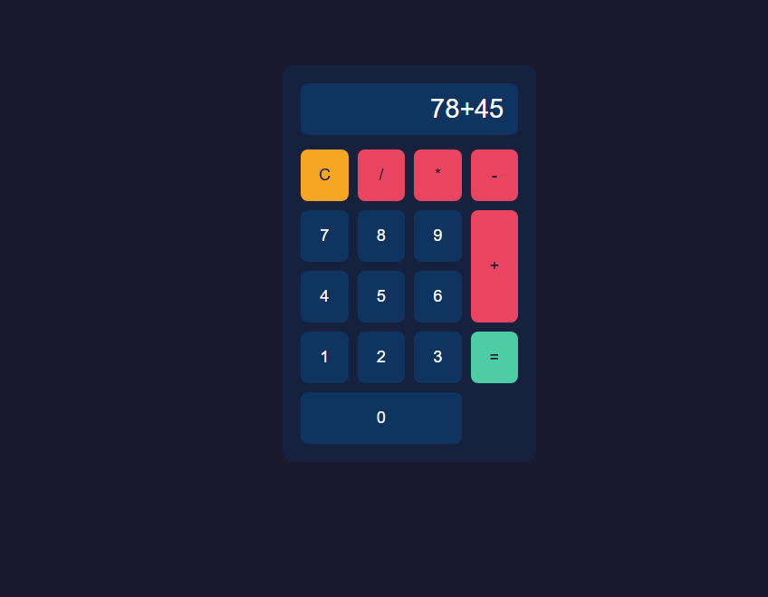
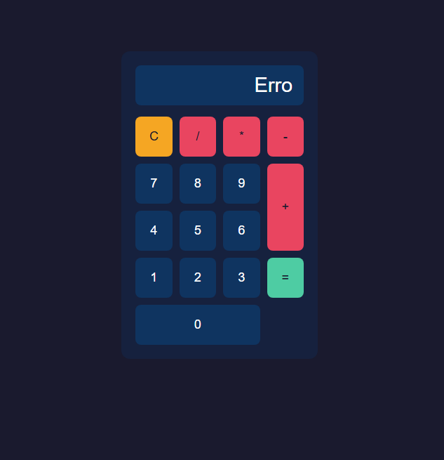

# 🧮 Calculadora Web

Uma calculadora simples e funcional desenvolvida com HTML, CSS e JavaScript puro, com tratamento de erros e layout responsivo.

---

## 📸 Screenshots

| Operação | Resultado | Erro |
|----------|-----------|------|
|  |  |  |

---

## 🚀 Funcionalidades

- Operações básicas: adição, subtração, multiplicação e divisão
- Tratamento de erros: visor vazio, operação incompleta e divisão por zero
- Botão C para limpar o visor
- Layout responsivo

---

## 🛠️ Tecnologias utilizadas

- HTML5
- CSS3 (Flexbox e CSS Grid)
- JavaScript (ES6+)

---

## 💡 Conceitos praticados

- Manipulação do DOM
- Eventos com `addEventListener`
- Atributos `data-*`
- CSS Grid com `grid-row: span` e `grid-column: span`
- Tratamento de erros com expressão regular

---

## 📦 Como executar

1. Clone o repositório:
```bash
git clone https://github.com/Dougiiee/projetoCalculadora.git
```

2. Acesse a pasta do projeto:
```bash
cd projetoCalculadora
```

3. Abra o arquivo `index.html` no navegador.

> Não é necessário instalar nenhuma dependência.

---

## 👨‍💻 Autor

Feito por **Douglas Laureano** — [LinkedIn](https://www.linkedin.com/in/douglas-laureano-dg/) · [GitHub](https://github.com/Dougiiee)
